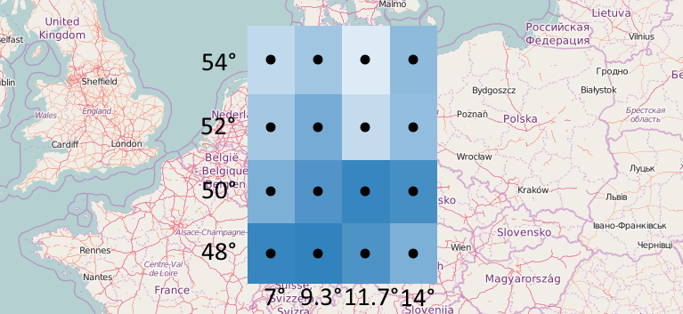



# Step 1: Spatial Domain



In the following, we will establish where our data values are located.
For this we must consider several things:

1. We will first think about the general structure of the data.
As we can see in the image above the data is organized into a grid which has 16 cells.

2. Next, we need to know the type of coordinates with which the grid cells are described.
In this case, it is longitude and latitude in degrees.
The global identifier for this coordinate reference system (CRS) is http://www.opengis.net/def/crs/OGC/1.3/CRS84.
The axis order in that system is longitude-latitude.

3. The grid should consist of same-size cells, which makes it a so-called regular grid.
It is very important to know what size means in this context.
Size here does not mean actual surface area (as in square meters) but rather refers to the size in degrees of latitude and longitude,
since that is the type of coordinates we use.
In the example, each cell has a latitude size of 2° and a longitude size of approximately 2.33°.

4. Lastly, from the image we know the coordinates of the cell centers.

Now we are ready to represent that information in CoverageJSON:
```js
{
  "type" : "Domain",
  "domainType" : "Grid",
  "axes": {
    "x" : { "start": 7, "stop": 14, "num": 4 },
    "y" : { "start": 54, "stop": 48, "num": 4 }
  },
  "referencing": [{
    "components": ["x","y"],
    "system": {
      "type": "GeodeticCRS",
      "id": "http://www.opengis.net/def/crs/OGC/1.3/CRS84"
    }
  }]
}
```
{{ playgroundLink('domains/grid.covjson') }}

This structure is called a *Domain*, in this case it is more specifically called a spatial domain as we only have spatial dimensions.

Some things that we should understand:
- The `start`/`stop`/`num` properties can only be used for regular numeric axes. For other cases, there is a different property called `"values"` which lists each coordinate individually.
- The coordinates in an axis have an ordering. Above, the longitude axis `x` is ascending from 7 to 14, while the latitude axis `y` is descending from 54 to 48. This ordering is not relevant at this stage but gets important again when we associate temperature values with coordinates. It determines how the data values have to be stored.
- The `components` property associates our axes to the axes of a CRS and matches them up in the same order, meaning that `x` is understood as longitude, and `y` as latitude, since this is how that particular CRS is defined (longitude-latitude order).
- `domainType` is optional but highly recommended. There are several [pre-defined domain types](https://covjson.org/domain-types/) which enforce a certain naming of axes and other details, making it easier for clients to specialize for certain domain types without having to be programmed in a fully generic way.


