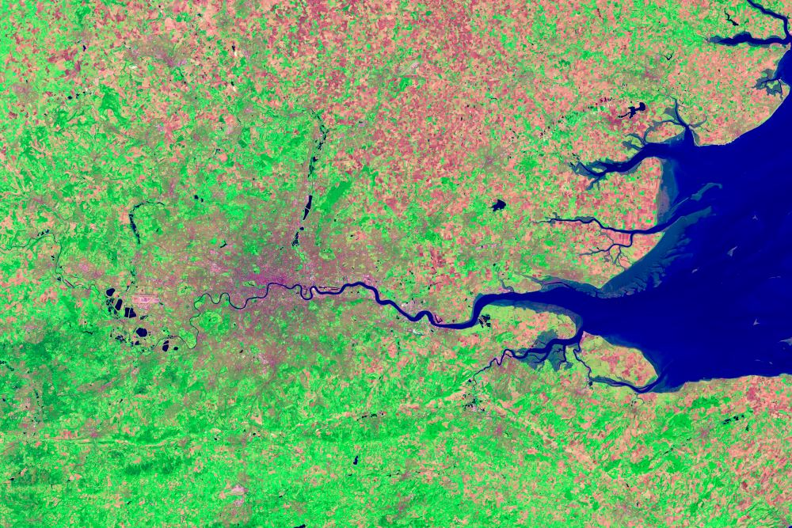

# What is a Coverage?

A coverage can be many things:
- Satellite image
- Fixed or moving sensor timeseries
- Digital elevation model
- Vertical measurements (for example, soil moisture in differents depths)
- Population statistics

In general, a coverage is anything where data values, either measured or computed by a model, are associated with positions in space, time, or other dimensions. A dimension is either continuous or categorical. An example of a dimension that is categorical and is not space or time is [gender](https://en.wikipedia.org/wiki/Gender), often used when creating social statistics. Dimensions like height or time are continuous.

It is very often the case though that the continuous dimensions of a coverage are organized into chunks, like pixels of a satellite image. These chunks exist merely so that one can efficiently store, retrieve, and process the data. The size of the chunks and by which method they are derived depends on how the coverage data will be used, that is, which requirements a given end user or application has. Bigger chunks lead to smaller data volume but less level of detail, and the other way around for smaller chunks. It is often the case that coverages are made available in multiple chunk sizes to serve as big an audience as possible.

## Support in CoverageJSON

CoverageJSON is built around the chunked organization of dimensions. It supports categorical dimensions and those continuous dimensions where the chunks are known. Since nearly all published coverage data uses chunks it is applicable in almost all cases.