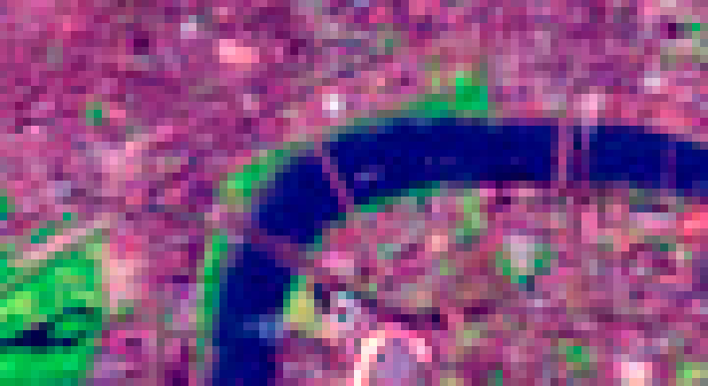

# What is a Coverage?

*Landsat 7 - ETM+ false color satellite image of London on September 13*

Data about the Earth and the environment can take many forms, from individual point measurements to large-scale satellite imagery. Although these data are highly diverse, they can often be modelled as *coverages*. 

A coverage is simply a structure that associates positions in space and time (and perhaps other dimensions) with data values. For example:
 - an aerial photograph can be thought of as a coverage that maps positions on the ground to colours;
 - a river gauge maps points in time to flow values;
 - a weather forecast maps points in space and time to values of temperature, wind speed, humidity and so forth.

(N.B. The word "coverage" may seem odd to some users in this context. The term is taken from the ISO 19123 specification and is also found in the standards of the [Open Geospatial Consortium](http://www.opengeospatial.org). Sometimes you’ll hear the word “coverage” used synonymously with “gridded data” or “raster data” but this isn’t really accurate. You can see from the above paragraph that non-gridded data (like a river gauge measurement) can also be modelled as coverages.)

Coverages are usually divided into discrete data values; for example, a satellite image is divided into pixels, and a river gauge measures flow at a certain time interval. The image below shows a zoomed-in version of the above Landsat image, more clearly showing its pixels:

*Zoomed Landsat 7 satellite image showing pixels*

## CoverageJSON overview

CoverageJSON (or "CovJSON" for short) has been designed as an encoding format for many kinds of coverages using [JSON](http://json.org), primarily with web developers in mind. We want to make it easier for people to develop highly interactive, powerful and engaging web visualisations using coverage data. This has always been a difficult task: coverage data can be very large and are often encoded in formats that are not easy to parse in web browsers. (We also anticipate that this format could be useful in other environments too - JSON is a format that is very easy to read and parse and therefore CoverageJSON could become a useful format in scripting environments like Python.)

The main features of CoverageJSON include:
 - all coverage types (grids, timeseries, trajectories, etc.) are encoded using a consistent set of rules, based on sets of orthogonal dimensions (rather like the [NetCDF](http://www.unidata.ucar.edu/software/netcdf/) format);
 - support for both continuous-valued data (e.g. temperature) and categorical data (e.g. land cover classifications);
 - support for geotemporal (e.g. latitude, longitude, height, time) and non-geotemporal (e.g. gender, country codes) dimensions;
 - scalable support for large datasets, by allowing data to be divided among multiple linked files;
 - support for Semantic Web and Linked Data applications, through the use of URIs to identify things and JSON-LD for (limited) conversion to RDF.

Although we have tried to keep the format as simple and intuitive as we can, there is still quite a lot to it! This cookbook will take you through step-by-step through its features, giving real examples throughout.
